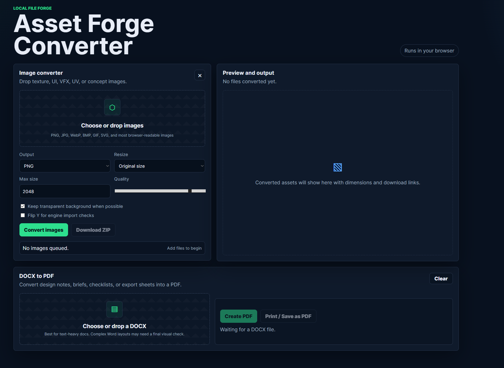

# Asset Forge Converter

Asset Forge Converter is a small browser-based tool for personal game development workflows. It helps convert image files into engine-friendly formats and turns DOCX notes or briefs into PDFs without needing a backend service.



## What it does

- Converts images to PNG, JPEG, or WebP.
- Supports batch image uploads with individual downloads.
- Exports all converted images as a ZIP file.
- Resizes images to original size, a custom maximum size, or nearest power-of-two dimensions.
- Includes quality control for compressed formats.
- Preserves transparency when possible.
- Can flip images vertically for engine import checks.
- Converts DOCX files into a PDF-ready browser preview.
- Downloads a generated PDF and also supports browser print/save-as-PDF.

## Why this exists

This tool is meant for asset prep while making games, especially when moving files between art tools, Blender, and game engines. It is useful for quick texture, UI, UV, VFX, and documentation conversions without opening a heavier editor.

## How to use it

### Image conversion

1. Open the site.
2. Drop one or more images into the Image converter area.
3. Choose the output format.
4. Pick a resize mode:
   - Original size keeps the source dimensions.
   - Nearest power of two is useful for engine texture workflows.
   - Custom max size scales large images down to a chosen maximum dimension.
5. Adjust quality if exporting JPEG or WebP.
6. Convert the images.
7. Download files one by one or export everything as a ZIP.

### DOCX to PDF

1. Drop a DOCX file into the DOCX to PDF area.
2. Create the PDF.
3. Check the preview.
4. Use the generated PDF download or the Print / Save as PDF button.

## Privacy

The conversion work runs in the browser. Files are processed locally by the page instead of being uploaded to a custom server.

## Current limitations

- DOCX conversion is best for text-heavy documents.
- Complex Word layouts, custom fonts, floating images, and advanced formatting may not match Microsoft Word exactly.
- Browser image export is limited to formats the browser can read and write through canvas, so PNG, JPEG, and WebP are the main output formats.
- This first version does not include game-engine-specific presets beyond power-of-two sizing and Y-flip support.

## Project structure

```text
dist/
  index.html
  styles.css
  app.js
.openai/
  hosting.json
```

The site is static and can be served from the `dist` folder.

## Deployment

This project is deployed as a static site from the `dist` folder.

For OpenAI Sites, keep `.openai/hosting.json` so the existing Site project is updated instead of creating a new one.

If deploying with another static host, use `dist` as the publish directory.

## Local preview

From the project folder, run:

```powershell
python -m http.server 4173 --directory dist
```

Then open:

```text
http://localhost:4173
```
